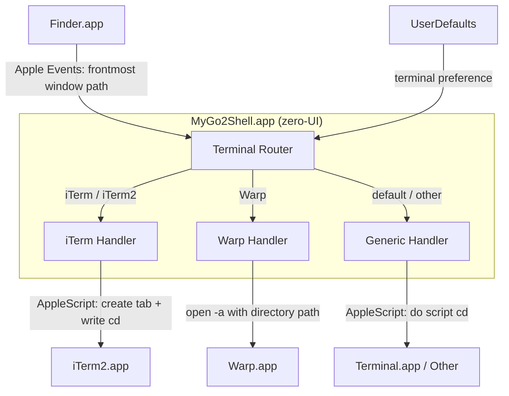

<p align="center">
  
</p>

<h1 align="center">MyGo2Shell</h1>

<p align="center">
  <strong>One click to open Terminal from Finder.</strong>
</p>

<p align="center">
  <a href="https://github.com/yuman07/MyGo2Shell/releases"></a>
  <a href="https://github.com/yuman07/MyGo2Shell/releases"></a>
  <a href="https://github.com/yuman07/MyGo2Shell/stargazers"></a>
  <br>
  
  
  
  
</p>

<p align="center">
  <a href="README.md">English</a> | <a href="README_ZH.md">中文</a>
</p>

---

## What is MyGo2Shell?

MyGo2Shell is a lightweight macOS utility that opens **Terminal.app** directly at the directory you're currently viewing in Finder. Simply drag it to the Finder toolbar and click — no configuration needed.

```
Finder (/Users/you/Projects/MyApp)
+----------------------------------------------+
|  <- ->    MyApp      [MyGo2Shell] <- Click!  |
|----------------------------------------------|
|  src/                                        |
|  docs/                                       |
|  README.md                                   |
+----------------------------------------------+
                       |
                       v
Terminal
+----------------------------------------------+
|  $ cd /Users/you/Projects/MyApp              |
|  $ _                                         |
+----------------------------------------------+
```

## Features

- **One-click launch** — Click the toolbar icon to instantly open Terminal at the current Finder directory
- **Multiple terminal support** — Works with Terminal.app, iTerm2, Warp, and more via a single `defaults write` command
- **Zero configuration** — Works out of the box with Terminal.app, no setup required
- **Minimal footprint** — Single-file Swift app (~100 lines), launches and exits immediately
- **Native macOS experience** — Uses AppleScript to communicate with Finder and Terminal seamlessly
- **Finder toolbar integration** — Lives right in your Finder toolbar for quick access

## Install

### macOS (14.0+, Apple Silicon)

#### Option 1: One-Line Install (Recommended)

Open Terminal and paste the following command:

```bash
curl -fsSL https://raw.githubusercontent.com/yuman07/MyGo2Shell/main/install.sh | bash
```

This downloads the latest release, installs it to `/Applications/`, and removes the macOS quarantine flag automatically.

#### Option 2: Download from GitHub

1. Go to the [Releases](https://github.com/yuman07/MyGo2Shell/releases) page
2. Download the latest `.zip` file
3. Extract and move `MyGo2Shell.app` to `/Applications/`

> **Note:** MyGo2Shell is not signed with an Apple Developer certificate, so macOS Gatekeeper may block it on first launch. Use any of the following methods to allow the app:
>
> **Method 1 — System Settings:**
> Open **System Settings > Privacy & Security**, scroll to the bottom, find the MyGo2Shell blocked message, and click **Open Anyway**.
>
> **Method 2 — Right-click Open:**
> Right-click (or Control-click) `MyGo2Shell.app` in `/Applications/`, select **Open**, then click **Open** in the confirmation dialog.
>
> **Method 3 — Remove quarantine flag:**
> ```bash
> xattr -cr /Applications/MyGo2Shell.app
> ```

#### Add to Finder Toolbar

> This is the key step to make MyGo2Shell truly useful!

| Step | Action |
|:----:|--------|
| **1** | Open any **Finder** window |
| **2** | Open `/Applications/` in another Finder window |
| **3** | Hold **`Cmd`** and **drag** `MyGo2Shell.app` into the Finder toolbar |
| **4** | Release — the icon now appears in the toolbar |

```
Before:  <- ->    Documents
After:   <- ->    Documents   [>_]  <- MyGo2Shell!
```

> **Tip:** To remove it later, hold `Cmd` and drag the icon out of the toolbar.

## Development

> **macOS only.** Build instructions are provided for macOS exclusively.

### Prerequisites

| Item | Minimum Version | Notes |
|------|----------------|-------|
| **macOS** | 15.6 (Sequoia) | Required by Xcode 26 |
| **Xcode** | 26.0 | Includes Swift 6, swiftc, actool, and Git. Download from [Mac App Store](https://apps.apple.com/app/xcode/id497799835) |

### Build with Command Line

```bash
# Clone the repository
git clone https://github.com/yuman07/MyGo2Shell.git

# Navigate into the project directory
cd MyGo2Shell

# Run the build script (compiles arm64 binary, bundles app icon, generates .app)
./build.sh

# Copy the built app to the Applications folder
cp -r build/MyGo2Shell.app /Applications/

# Remove the macOS quarantine flag so the app can launch
xattr -cr /Applications/MyGo2Shell.app
```

### Build with Xcode

```bash
# Clone the repository
git clone https://github.com/yuman07/MyGo2Shell.git

# Navigate into the project directory
cd MyGo2Shell

# Open the Xcode project
open MyGo2Shell.xcodeproj
```

Then in Xcode:

1. Select **Product > Build** (or press `Cmd + B`) to compile
2. Select **Product > Show Build Folder in Finder** to locate `MyGo2Shell.app`
3. Move `MyGo2Shell.app` to `/Applications/`

## Technical Overview

MyGo2Shell is a zero-UI Cocoa application (`LSUIElement = true`) that acts as a bridge between Finder and your terminal emulator. It has no visible windows, no menu bar icon, and no lingering process — it launches, does its job, and exits.

The core design follows a **fire-and-forget** pattern: the app bootstraps an `NSApplication` run loop solely to host AppleScript execution, then terminates on the next iteration. This is necessary because `NSAppleScript` requires an active run loop to dispatch Apple Events. Without it, Finder and terminal queries would silently fail.

When launched, the app executes a three-phase workflow:

1. **Path acquisition** — An `NSAppleScript` queries Finder for the frontmost window's target directory via Apple Events. If no Finder window is open (or the target cannot be resolved as an alias), the script falls back to `~/Desktop`. This two-tier approach handles edge cases like Finder windows showing search results, AirDrop, or network volumes that lack a POSIX path.

2. **Terminal routing** — The app reads the `terminal` key from `UserDefaults` (set via `defaults write com.go2shell.MyGo2Shell terminal "name"`). The raw value is sanitized by stripping all characters except alphanumerics, spaces, and hyphens — this prevents AppleScript injection since the terminal name is interpolated into script strings. The sanitized name is then matched (case-insensitive) against built-in handlers: iTerm2 gets tab-aware AppleScript that reuses an existing window or creates a new one; Warp gets `open -a` with a native directory argument; everything else gets the generic `do script` AppleScript interface. If the configured terminal is not found in `/Applications/`, `/System/Applications/`, or `~/Applications/`, the app falls back to Terminal.app.

3. **Self-termination** — After dispatching the terminal command, `NSApp.terminate` is called asynchronously via `DispatchQueue.main.async`. The async dispatch ensures the AppleScript execution completes before the app tears down.

### Tech Stack

| Category | Technology |
|----------|-----------|
| Language | Swift 6.0 |
| Framework | Cocoa (AppKit) |
| IPC | AppleScript via `NSAppleScript` |
| Configuration | `UserDefaults` (`defaults write`) |
| Build System | Xcode / shell script (`swiftc` + `actool`) |
| Architecture | arm64 (Apple Silicon) |
| Deployment Target | macOS 14.0 (Sonoma) |

### Architecture



- **Path acquisition flow** — Finder.app receives an Apple Events query from the Terminal Router, returning the POSIX path of the frontmost window's target. If the query fails, the router falls back to `~/Desktop`
- **Terminal routing logic** — The router reads the user's terminal preference from UserDefaults, sanitizes it (stripping unsafe characters), and dispatches to one of three specialized handlers based on case-insensitive name matching
- **Handler specialization** — Each handler is optimized for its target: iTerm Handler uses tab-aware AppleScript (reuses existing windows), Warp Handler uses native `open -a` (Warp accepts directory arguments directly), and Generic Handler uses the universal `do script` AppleScript interface that works with any scriptable terminal

### Project Structure

```
MyGo2Shell/
|-- MyGo2Shell/
|   |-- main.swift              # App delegate, terminal routing, AppleScript execution
|   |-- Info.plist              # Bundle metadata (LSUIElement, version, permissions)
|   |-- MyGo2Shell.entitlements # Apple Events automation entitlement
|   `-- Assets.xcassets/        # App icon (16x16 to 512x512, 1x and 2x)
|-- assets/
|   `-- app-icon.png            # Source icon file (128x128)
|-- MyGo2Shell.xcodeproj/       # Xcode project configuration
|-- build.sh                    # CLI build: swiftc + actool -> .app bundle
|-- install.sh                  # One-line installer (downloads latest release)
|-- README.md                   # English documentation
|-- README_ZH.md                # Chinese documentation
`-- LICENSE                     # MIT License
```

## FAQ

**Q: macOS says the app is "damaged and can't be opened"?**
> This is caused by macOS Gatekeeper quarantining unsigned apps. Run the following command to remove the quarantine flag:
> ```bash
> xattr -cr /Applications/MyGo2Shell.app
> ```
> Then open it normally.

**Q: Can I use iTerm2 / Warp / other terminals instead of Terminal.app?**
> Yes! Use `defaults write` to set your preferred terminal:
> ```bash
> # Use iTerm2
> defaults write com.go2shell.MyGo2Shell terminal -string "iTerm"
>
> # Use Warp
> defaults write com.go2shell.MyGo2Shell terminal -string "Warp"
>
> # Reset to default Terminal.app
> defaults delete com.go2shell.MyGo2Shell terminal
> ```
> The terminal name should match the application name in `/Applications/`. iTerm2 and Warp have built-in native handling; other terminals use the standard AppleScript `do script` interface.

**Q: The app opens Terminal but doesn't navigate to the right folder?**
> Make sure you've granted automation permissions in **System Settings > Privacy & Security > Automation**. You may need to remove and re-add the permissions.

**Q: On first launch, macOS asks for permission to control Finder / Terminal?**
> This is expected. MyGo2Shell needs Apple Events access to read Finder's current directory and to open a terminal window. Click **OK** to grant permission. You can manage this in **System Settings > Privacy & Security > Automation**.

## Acknowledgments

Inspired by the original [Go2Shell](https://zipzapmac.com/Go2Shell) which is no longer actively maintained. MyGo2Shell is a clean, open-source reimplementation built with pure Swift and AppleScript.

## License

This project is open source and available under the [MIT License](LICENSE).
