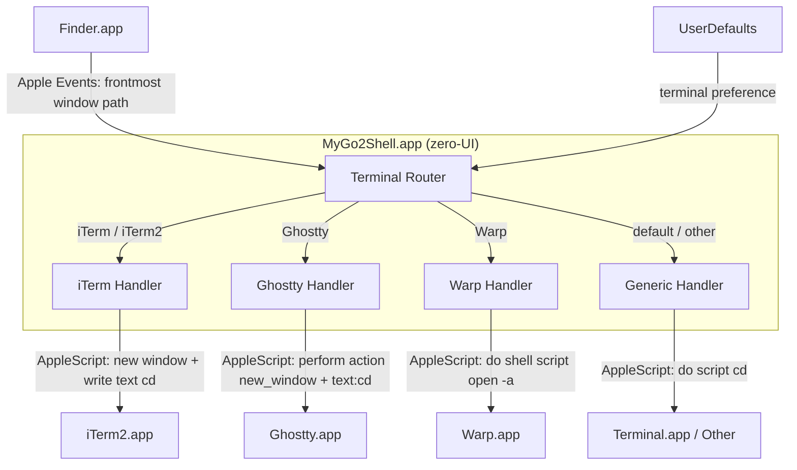

<p align="center">
  
</p>

<h1 align="center">MyGo2Shell</h1>

<p align="center">
  <strong>One click to open Terminal from Finder.</strong>
</p>

<p align="center">
  <a href="https://github.com/yuman07/MyGo2Shell/releases"></a>
  <a href="https://github.com/yuman07/MyGo2Shell/releases"></a>
  <a href="https://github.com/yuman07/MyGo2Shell/stargazers"></a>
  <br>
  
  
  
  
</p>

<p align="center">
  <a href="README.md">English</a> | <a href="README_ZH.md">中文</a>
</p>

---

## What is MyGo2Shell?

MyGo2Shell is a lightweight macOS utility that opens your terminal directly at the directory you're currently viewing in Finder. It supports **Terminal.app**, **iTerm2**, **Ghostty**, **Warp**, and more. Simply drag it to the Finder toolbar and click — no configuration needed.

```
Finder (/Users/you/Projects/MyApp)
+----------------------------------------------+
|  <- ->    MyApp      [MyGo2Shell] <- Click!  |
|----------------------------------------------|
|  src/                                        |
|  docs/                                       |
|  README.md                                   |
+----------------------------------------------+
                       |
                       v
Terminal
+----------------------------------------------+
|  $ cd /Users/you/Projects/MyApp              |
|  $ _                                         |
+----------------------------------------------+
```

## Features

- **One-click launch** — Click the toolbar icon to instantly open Terminal at the current Finder directory
- **Multiple terminal support** — Works with Terminal.app, iTerm2, Ghostty, Warp, and more via a single `defaults write` command
- **Zero configuration** — Works out of the box with Terminal.app, no setup required
- **Minimal footprint** — Single-file Swift app (~170 lines), launches and exits immediately
- **Native macOS experience** — Uses AppleScript to communicate with Finder and Terminal seamlessly
- **Finder toolbar integration** — Lives right in your Finder toolbar for quick access

## Install

### macOS (15.0+, Apple Silicon)

#### Option 1: One-Line Install (Recommended)

Open Terminal and paste the following command:

```bash
curl -fsSL https://raw.githubusercontent.com/yuman07/MyGo2Shell/main/install.sh | bash
```

This downloads the latest release, installs it to `/Applications/`, and removes the macOS quarantine flag automatically.

#### Option 2: Download from GitHub

1. Go to the [Releases](https://github.com/yuman07/MyGo2Shell/releases) page
2. Download the latest `.dmg` file
3. Double-click to mount it and drag `MyGo2Shell.app` to `/Applications/`

> **Note:** MyGo2Shell is not signed with an Apple Developer certificate, so macOS Gatekeeper may block it on first launch. Use any of the following methods to allow the app:
>
> **Method 1 — System Settings:**
> Open **System Settings > Privacy & Security**, scroll to the bottom, find the MyGo2Shell blocked message, and click **Open Anyway**.
>
> **Method 2 — Right-click Open:**
> Right-click (or Control-click) `MyGo2Shell.app` in `/Applications/`, select **Open**, then click **Open** in the confirmation dialog.
>
> **Method 3 — Remove quarantine flag:**
> ```bash
> xattr -cr /Applications/MyGo2Shell.app
> ```

#### Add to Finder Toolbar

> This is the key step to make MyGo2Shell truly useful!

| Step | Action |
|:----:|--------|
| **1** | Open any **Finder** window |
| **2** | Open `/Applications/` in another Finder window |
| **3** | Hold **`Cmd`** and **drag** `MyGo2Shell.app` into the Finder toolbar |
| **4** | Release — the icon now appears in the toolbar |

```
Before:  <- ->    Documents
After:   <- ->    Documents   [>_]  <- MyGo2Shell!
```

> **Tip:** To remove it later, hold `Cmd` and drag the icon out of the toolbar.

## Usage

### Switch Terminal

By default, MyGo2Shell opens **Terminal.app**. To use a different terminal, run the corresponding `defaults write` command:

```bash
# Use iTerm2
defaults write com.go2shell.MyGo2Shell terminal -string "iTerm"

# Use Ghostty (requires Ghostty 1.3+)
defaults write com.go2shell.MyGo2Shell terminal -string "Ghostty"

# Use Warp
defaults write com.go2shell.MyGo2Shell terminal -string "Warp"

# Reset to default Terminal.app
defaults delete com.go2shell.MyGo2Shell terminal
```

The terminal name should match the application name in `/Applications/`. iTerm2, Ghostty, and Warp have built-in native handling; other terminals use the standard AppleScript `do script` interface.

### Automation Permissions

On first launch, macOS will ask for permission to control Finder and your terminal. Click **OK** to grant access — MyGo2Shell needs Apple Events to read Finder's current directory and open a terminal window.

If the app opens the terminal but doesn't navigate to the right folder, check **System Settings > Privacy & Security > Automation** and make sure the relevant permissions are granted. You may need to remove and re-add them.

## Development

> **macOS only.** Build instructions are provided for macOS exclusively.

### Prerequisites

| Item | Minimum Version | Notes |
|------|----------------|-------|
| **macOS** | 15.6 (Sequoia) | Required by Xcode 26.3 |
| **Xcode** | 26.3 | Includes Swift 6, swiftc, actool, and Git. Download from [Mac App Store](https://apps.apple.com/app/xcode/id497799835) |

### Local Development Build (Xcode)

Local builds are for development only. **Official releases are produced exclusively by the [GitHub Actions release workflow](.github/workflows/release.yml)** — do not distribute locally built binaries.

```bash
# Clone the repository
git clone https://github.com/yuman07/MyGo2Shell.git

# Navigate into the project directory
cd MyGo2Shell

# Open the Xcode project
open MyGo2Shell.xcodeproj
```

Then in Xcode:

1. Select **Product > Build** (or press `Cmd + B`) to compile
2. Select **Product > Show Build Folder in Finder** to locate `MyGo2Shell.app`
3. Move `MyGo2Shell.app` to `/Applications/` for local testing

### Cutting a Release

Maintainers trigger the **Release** workflow (`Actions > Release > Run workflow`) with a semver tag; GitHub Actions builds the app bundle on the `macos-26` runner, packages it as a `.dmg`, and publishes it as a GitHub Release asset.

## Technical Overview

MyGo2Shell is a zero-UI Cocoa application (`LSUIElement = true`) that acts as a bridge between Finder and your terminal emulator. It has no visible windows, no menu bar icon, and no lingering process — it launches, does its job, and exits.

The core design follows a **fire-and-forget** pattern: the app bootstraps an `NSApplication` run loop solely to host AppleScript execution, then terminates on the next iteration. This is necessary because `NSAppleScript` requires an active run loop to dispatch Apple Events. Without it, Finder and terminal queries would silently fail.

When launched, the app executes a three-phase workflow:

1. **Path acquisition** — An `NSAppleScript` queries Finder for the frontmost window's target directory via Apple Events. If no Finder window is open (or the target cannot be resolved as an alias), the script falls back to `~/Desktop`. This two-tier approach handles edge cases like Finder windows showing search results, AirDrop, or network volumes that lack a POSIX path.

2. **Terminal routing** — The app reads the `terminal` key from `UserDefaults` (set via `defaults write com.go2shell.MyGo2Shell terminal "name"`). The raw value is sanitized by stripping all characters except alphanumerics, spaces, and hyphens — this prevents AppleScript injection since the terminal name is interpolated into script strings. If the sanitized result is empty, the app defaults to `Terminal`. The sanitized name is then matched (case-insensitive) against built-in handlers: iTerm / iTerm2 always opens a new window (`create window with default profile` when running, or the auto-spawned startup window on cold launch); Ghostty uses `perform action "new_window"` on the focused terminal when running (routing through the same keybind notification path as Cmd+N so the new window bypasses Ghostty's `tabbingMode = .preferred` auto-merge that would otherwise turn a scripted `new window with configuration` into a tab), then sends `cd <path> && clear` + Return via `perform action "text:..."`; cold-launch Ghostty falls back to `new window with configuration` (safe because no existing tab group can merge with it); Warp uses `do shell script "open -a Warp <path>"` via the native directory argument; everything else falls through to a generic `do script` AppleScript handler. Every handler distinguishes a running-app fast path from a cold-launch slow path that polls `count of windows > 0` before issuing the command, and every `cd` is followed by `&& clear` to present a clean prompt. If the configured terminal is not found in `/Applications/`, `/System/Applications/`, `/System/Applications/Utilities/`, or `~/Applications/`, the app falls back to Terminal.app.

3. **Self-termination** — `openShellInFinderDirectory` is fully synchronous (every `NSAppleScript.executeAndReturnError` blocks until the script returns). After it returns, `NSApp.terminate` is scheduled on the next main-loop iteration via `DispatchQueue.main.async`, which lets `applicationDidFinishLaunching` return cleanly before the app tears itself down.

### Tech Stack

| Category | Technology |
|----------|-----------|
| Language | Swift 6.0 |
| Framework | Cocoa (AppKit) |
| IPC | AppleScript via `NSAppleScript` |
| Configuration | `UserDefaults` (`defaults write`) |
| Build System | Xcode (local dev) / GitHub Actions (`swiftc` + `actool` + `hdiutil`, release) |
| Architecture | arm64 (Apple Silicon) |
| Deployment Target | macOS 15.0 (Sequoia) |

### Architecture



- **Path acquisition flow** — Finder.app receives an Apple Events query from the Terminal Router, returning the POSIX path of the frontmost window's target. If the query fails, the router falls back to `~/Desktop`
- **Terminal routing logic** — The router reads the user's terminal preference from UserDefaults, sanitizes it (stripping unsafe characters, defaulting to `Terminal` if empty), and dispatches to one of four specialized handlers based on case-insensitive name matching; an unrecognized but installed name falls through to the generic handler, and an uninstalled name falls back to Terminal.app
- **Handler specialization** — Each handler is optimized for its target: iTerm Handler always opens a new window (`create window with default profile` on the running fast path, or the auto-spawned startup window on cold launch); Ghostty Handler on the running fast path issues `perform action "new_window"` on the focused terminal (matching Cmd+N's runloop path so the new window escapes Ghostty's scripting-time `tabbingMode = .preferred` auto-tab), then sends `cd <path> && clear` + Return through `perform action "text:..."`; cold-launch Ghostty uses `new window with configuration` (safe since no tab group can merge); Warp Handler dispatches via AppleScript `do shell script "open -a Warp <path>"` (Warp accepts directory arguments directly); Generic Handler uses the universal `do script` AppleScript interface that works with any scriptable terminal. All handlers have a running-app fast path and a cold-launch slow path that waits for the first window to appear.

### Project Structure

```
MyGo2Shell/
|-- MyGo2Shell/
|   |-- main.swift              # App delegate, terminal routing, AppleScript execution
|   |-- Info.plist              # Bundle metadata (LSUIElement, version, permissions)
|   |-- MyGo2Shell.entitlements # Apple Events automation entitlement
|   `-- Assets.xcassets/        # App icon (16x16 to 512x512, 1x and 2x)
|-- assets/
|   `-- app-icon.png            # Source icon file (128x128)
|-- MyGo2Shell.xcodeproj/       # Xcode project configuration
|-- .github/workflows/          # GitHub Actions release workflow (swiftc + actool + hdiutil)
|-- install.sh                  # One-line installer (downloads latest release)
|-- README.md                   # English documentation
|-- README_ZH.md                # Chinese documentation
`-- LICENSE                     # MIT License
```

## Acknowledgments

Inspired by the original [Go2Shell](https://zipzapmac.com/Go2Shell) which is no longer actively maintained. MyGo2Shell is a clean, open-source reimplementation built with pure Swift and AppleScript.

## License

This project is open source and available under the [MIT License](LICENSE).
