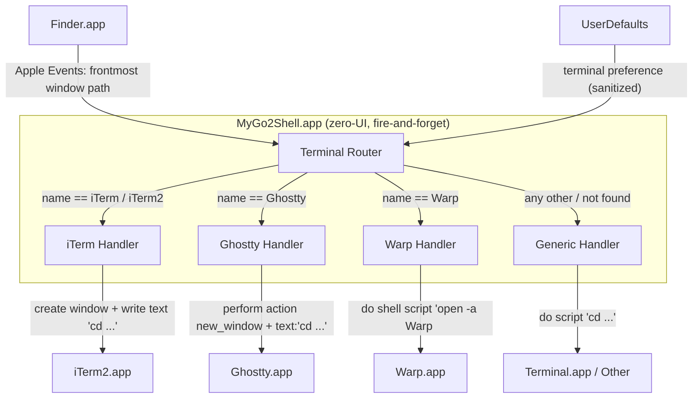

<p align="center">
  
</p>

<h1 align="center">MyGo2Shell</h1>

<p align="center">
  <strong>One click to open Terminal from Finder.</strong>
</p>

<p align="center">
  <a href="https://github.com/yuman07/MyGo2Shell/releases"></a>
  <a href="https://github.com/yuman07/MyGo2Shell/releases"></a>
  <a href="https://github.com/yuman07/MyGo2Shell/stargazers"></a>
  <br>
  
  
  
  
</p>

<p align="center">
  <a href="README.md">English</a> | <a href="README_ZH.md">中文</a>
</p>

---

## What is MyGo2Shell?

MyGo2Shell is a lightweight macOS utility that opens your terminal directly at the directory you're currently viewing in Finder. It supports **Terminal.app**, **iTerm2**, **Ghostty**, **Warp**, and any other scriptable terminal. Just drag it onto the Finder toolbar and click — no configuration needed.

```
Finder (/Users/you/Projects/MyApp)
+----------------------------------------------+
|  <- ->    MyApp      [MyGo2Shell] <- Click!  |
|----------------------------------------------|
|  src/                                        |
|  docs/                                       |
|  README.md                                   |
+----------------------------------------------+
                       |
                       v
Terminal
+----------------------------------------------+
|  $ cd /Users/you/Projects/MyApp              |
|  $ _                                         |
+----------------------------------------------+
```

## Features

- **One-click launch** — Click the toolbar icon to instantly open a terminal at the current Finder directory
- **Multiple terminal support** — Switch between Terminal.app, iTerm2, Ghostty, Warp, and any scriptable terminal with a single `defaults write` command
- **Zero configuration** — Works out of the box with Terminal.app, no setup required
- **Minimal footprint** — Single-file Swift app (~180 lines), launches and exits immediately
- **Native macOS experience** — Uses AppleScript to communicate with Finder and the terminal seamlessly
- **Finder toolbar integration** — Lives right in your Finder toolbar for instant access

## Install

### macOS (15.0+, Apple Silicon)

#### Option 1: One-Line Install (Recommended)

Open Terminal and paste the following command:

```bash
curl -fsSL https://raw.githubusercontent.com/yuman07/MyGo2Shell/main/install.sh | bash
```

This downloads the latest release, installs it to `/Applications/`, and removes the macOS quarantine flag automatically.

#### Option 2: Download from GitHub

1. Go to the [Releases](https://github.com/yuman07/MyGo2Shell/releases) page
2. Download the latest `.dmg` file
3. Double-click to mount it and drag `MyGo2Shell.app` into `/Applications/`

> **Note:** MyGo2Shell is not signed with an Apple Developer certificate, so macOS Gatekeeper may block it on first launch. Use any of the following methods to allow the app:
>
> **Method 1 — System Settings:**
> Open **System Settings > Privacy & Security**, scroll to the bottom, find the MyGo2Shell blocked message, and click **Open Anyway**.
>
> **Method 2 — Right-click Open:**
> Right-click (or Control-click) `MyGo2Shell.app` in `/Applications/`, select **Open**, then click **Open** in the confirmation dialog.
>
> **Method 3 — Remove quarantine flag:**
> ```bash
> xattr -cr /Applications/MyGo2Shell.app
> ```

#### Add to Finder Toolbar

> This is the key step to make MyGo2Shell truly useful!

| Step | Action |
|:----:|--------|
| **1** | Open any **Finder** window |
| **2** | Open `/Applications/` in another Finder window |
| **3** | Hold **`Cmd`** and **drag** `MyGo2Shell.app` into the Finder toolbar |
| **4** | Release — the icon now appears in the toolbar |

```
Before:  <- ->    Documents
After:   <- ->    Documents   [>_]  <- MyGo2Shell!
```

> **Tip:** To remove it later, hold `Cmd` and drag the icon out of the toolbar.

## Usage

### Switch Terminal

By default, MyGo2Shell opens **Terminal.app**. To use a different terminal, run the corresponding `defaults write` command:

```bash
# Use iTerm2
defaults write com.go2shell.MyGo2Shell terminal -string "iTerm"

# Use Ghostty (requires Ghostty 1.3+ for `perform action "new_window"`)
defaults write com.go2shell.MyGo2Shell terminal -string "Ghostty"

# Use Warp
defaults write com.go2shell.MyGo2Shell terminal -string "Warp"

# Any other scriptable terminal — the name must match the .app in /Applications/
defaults write com.go2shell.MyGo2Shell terminal -string "Alacritty"

# Reset to default Terminal.app
defaults delete com.go2shell.MyGo2Shell terminal
```

iTerm2, Ghostty, and Warp have built-in native handlers; any other terminal falls back to the generic AppleScript `do script` interface. If the configured terminal is not found under `/Applications/`, `/System/Applications/`, `/System/Applications/Utilities/`, or `~/Applications/`, the app automatically falls back to Terminal.app.

### Automation Permissions

On first launch, macOS will ask for permission to control Finder and your terminal. Click **OK** to grant access — MyGo2Shell uses Apple Events to read Finder's current directory and open a terminal window.

If the terminal opens but does not navigate to the right folder, check **System Settings > Privacy & Security > Automation** and make sure the relevant permissions are granted. You may need to remove and re-add them.

## Development

> **macOS only.** Build instructions are provided for macOS exclusively.

### Recommended prerequisites

| Dependency | Recommended Version |
|------------|---------------------|
| **macOS** | 26.4.1 (Tahoe) |
| **Xcode** | 26.4.1 (includes Swift 6.3.1, `swiftc`, `actool`, and Git) |

<sub>These are the versions on the author's local machine and are known to build and run the app successfully. Lower versions may also work but have not been verified — no guarantees below this baseline.</sub>

### Checking and installing prerequisites

Use this section to confirm that your machine already meets the recommended baseline, and upgrade any component that falls short.

**macOS**

- **Check current version:** run `sw_vers -productVersion` in Terminal, or go to **Apple menu > About This Mac**.
- **Upgrade (recommended path):** **System Settings > General > Software Update**, then install any available macOS update.

**Xcode**

- **Check whether installed and which version:** run `xcodebuild -version` in Terminal. If the command prints an error, Xcode is not installed (or `xcode-select` points to the Command Line Tools only).
- **Install (recommended path):** install Xcode from the [Mac App Store](https://apps.apple.com/app/xcode/id497799835). After installation, launch it once so it finishes provisioning the toolchain and accepts the license.
- **Upgrade:** update Xcode from the Mac App Store when a new version is published.

### Build steps

Once the prerequisites above are satisfied, clone and build:

```bash
# Clone the repository
git clone https://github.com/yuman07/MyGo2Shell.git

# Enter the project directory
cd MyGo2Shell

# Open the Xcode project
open MyGo2Shell.xcodeproj
```

Then in Xcode:

1. Select **Product > Build** (or press `Cmd + B`) to compile.
2. Select **Product > Show Build Folder in Finder** to locate `MyGo2Shell.app`.
3. Move `MyGo2Shell.app` into `/Applications/` to test it end to end.

Local builds are for development only. **Official releases are produced exclusively by the [GitHub Actions release workflow](.github/workflows/release.yml)** — do not distribute locally built binaries.

### Cutting a release

Maintainers trigger the **Release** workflow (`Actions > Release > Run workflow`) with a semver version (e.g. `1.0.0`). GitHub Actions builds the app bundle with `swiftc` + `actool` on a `macos-26` runner pinned to Xcode 26.3, packages it as a `.dmg` via `hdiutil`, and publishes it as a GitHub Release asset.

## Technical Overview

MyGo2Shell is a zero-UI Cocoa application (`LSUIElement = true`) that acts as a one-shot bridge between Finder and your terminal emulator. It has no visible windows, no menu bar icon, and no lingering process — it launches, does its job, and exits.

The core design follows a **fire-and-forget** pattern: the app bootstraps an `NSApplication` run loop solely to host AppleScript execution, then terminates on the next main-loop iteration. This is necessary because `NSAppleScript` needs an active run loop to dispatch Apple Events; without it, queries to Finder and the terminal would silently fail.

When launched, the app executes a three-phase workflow:

1. **Path acquisition** — An `NSAppleScript` asks Finder for the frontmost window's target directory and returns its POSIX path. If no Finder window is open (or the target cannot be resolved as an alias — e.g. a search results view, AirDrop, or a network volume without a POSIX path), the script falls back to `~/Desktop`.

2. **Terminal routing** — The app reads the `terminal` key from `UserDefaults` (set via `defaults write com.go2shell.MyGo2Shell terminal "name"`). The raw value is sanitized by stripping all characters except alphanumerics, spaces, and hyphens, which prevents AppleScript injection since the terminal name is interpolated into script strings. An empty sanitized value defaults to `Terminal`. The name is matched case-insensitively against built-in handlers:
   - **iTerm / iTerm2** — always opens a new window (`create window with default profile` when iTerm is already running; on cold launch, the auto-spawned startup window is reused), then sends `cd <path> && clear` via `write text`.
   - **Ghostty** — when Ghostty is running, calls `perform action "new_window"` on the focused terminal. This routes through the same keybind notification path as `Cmd+N`, which bypasses the AppleScript-time auto-tab behavior caused by Ghostty's `tabbingMode = .preferred` (a direct `new window with configuration` would otherwise be folded into an existing tab group). The new terminal then receives `cd <path> && clear` + Return via `perform action "text:..."`. On cold launch, the handler falls back to `new window with configuration`, which is safe because no existing tab group can merge with it.
   - **Warp** — dispatches via `do shell script "open -a Warp <path>"`, using Warp's native directory argument.
   - **Any other name** — falls through to a generic `do script` AppleScript handler that works with any scriptable terminal.

   Every handler distinguishes a *running-app fast path* from a *cold-launch slow path* that polls `count of windows > 0` before issuing the command, and every `cd` is followed by `&& clear` to show a clean prompt. If the configured terminal is not found in `/Applications/`, `/System/Applications/`, `/System/Applications/Utilities/`, or `~/Applications/`, the app falls back to Terminal.app.

3. **Self-termination** — `openShellInFinderDirectory` is fully synchronous (every `NSAppleScript.executeAndReturnError` blocks until the script returns). After it returns, `NSApp.terminate` is scheduled on the next main-loop iteration via `DispatchQueue.main.async`, letting `applicationDidFinishLaunching` unwind cleanly before the app tears itself down.

### Tech stack

| Category | Technology |
|----------|-----------|
| Language | Swift 6.0 |
| Framework | Cocoa (AppKit) |
| IPC | AppleScript via `NSAppleScript` |
| Configuration | `UserDefaults` (`defaults write`) |
| Build — local dev | Xcode |
| Build — release | GitHub Actions (`swiftc` + `actool` + `hdiutil`) on `macos-26` with Xcode 26.3 |
| Architecture | arm64 (Apple Silicon) |
| Deployment Target | macOS 15.0 (Sequoia) |

### Architecture



- **Path acquisition flow** — Finder.app answers an Apple Events query from the Terminal Router with the POSIX path of the frontmost window's target; if the query fails, the router falls back to `~/Desktop`.
- **Terminal routing logic** — The router reads the user's preferred terminal from UserDefaults, sanitizes it (stripping unsafe characters, defaulting to `Terminal` if empty), and dispatches to one of four specialized handlers based on case-insensitive name matching; an unrecognized-but-installed name falls through to the generic handler, and an uninstalled name falls back to Terminal.app.
- **Handler specialization** — Each handler is tuned for its target: iTerm Handler forces a new window to avoid reusing an existing session; Ghostty Handler routes through `perform action "new_window"` to escape Ghostty's scripting-time auto-tab merging and then delivers the `cd` command via the same action channel; Warp Handler takes the shortest path through Warp's native directory argument; Generic Handler uses the universal `do script` AppleScript interface that works with any scriptable terminal. All handlers have a running-app fast path and a cold-launch slow path that waits for the first window to appear before issuing commands.

### Project structure

```
MyGo2Shell/
|-- MyGo2Shell/
|   |-- main.swift              # App delegate, terminal routing, AppleScript execution
|   |-- Info.plist              # Bundle metadata (LSUIElement, version, Apple Events usage description)
|   |-- MyGo2Shell.entitlements # Apple Events automation entitlement
|   `-- Assets.xcassets/        # App icon (16x16 to 512x512, 1x and 2x)
|-- assets/
|   `-- app-icon.png            # Source icon file (128x128)
|-- MyGo2Shell.xcodeproj/       # Xcode project configuration
|-- .github/workflows/          # GitHub Actions release workflow (swiftc + actool + hdiutil)
|-- install.sh                  # One-line installer (downloads latest release)
|-- README.md                   # English documentation
|-- README_ZH.md                # Chinese documentation
`-- LICENSE                     # MIT License
```

## FAQ

**Q: I clicked the toolbar icon but nothing happened.**

> Make sure you granted the permission prompt on first launch. Open **System Settings > Privacy & Security > Automation**, find MyGo2Shell, and ensure both **Finder** and your configured terminal are enabled. If the prompt never appeared, removing quarantine with `xattr -cr /Applications/MyGo2Shell.app` and relaunching usually fixes it.

**Q: The terminal opens, but in the wrong folder (usually `~` or `~/Desktop`).**

> This means MyGo2Shell could not resolve the Finder window's target as a real filesystem path. Common causes: the front Finder window is showing search results, AirDrop, or a network location without a POSIX path. Navigate to a regular folder in Finder and try again.

**Q: Can I use a terminal that isn't iTerm2, Ghostty, or Warp?**

> Yes. Run `defaults write com.go2shell.MyGo2Shell terminal -string "<AppName>"` with the exact `.app` name under `/Applications/`. The generic handler uses AppleScript's `do script`, which works with most scriptable terminals (Alacritty, kitty via their macOS app bundle, etc.).

**Q: Why does Ghostty need version 1.3 or later?**

> The Ghostty handler depends on `perform action "new_window"`, which was added in Ghostty 1.3. This is the only reliable way to create a detached window that bypasses Ghostty's AppleScript-time auto-tab behavior on the running-app fast path.

## Acknowledgments

Inspired by the original [Go2Shell](https://zipzapmac.com/Go2Shell), which is no longer actively maintained. MyGo2Shell is a clean-room open-source reimplementation built with pure Swift and AppleScript.

## License

This project is open source and available under the [MIT License](LICENSE).
