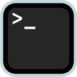

<p align="center">
  
</p>

<h1 align="center">MyGo2Shell</h1>

<p align="center">
  <strong>一键从 Finder 打开终端。</strong>
</p>

<p align="center">
  <a href="https://github.com/yuman07/MyGo2Shell/releases"></a>
  <a href="https://github.com/yuman07/MyGo2Shell/releases"></a>
  <a href="https://github.com/yuman07/MyGo2Shell/stargazers"></a>
  <br>
  
  
  
  
</p>

<p align="center">
  <a href="README.md">English</a> | <a href="README_CN.md">中文</a>
</p>

---

## MyGo2Shell 是什么?

MyGo2Shell 是一款轻量级 macOS 工具，能够在你当前浏览的 Finder 目录下直接打开 **Terminal.app**。只需将它拖到 Finder 工具栏，点击即用，无需任何配置。

```
 Finder 窗口 (/Users/you/Projects/MyApp)
 ┌──────────────────────────────────────────────┐
 │  ← → ▲  📁 MyApp    [MyGo2Shell]  <- 点击!  │
 ├──────────────────────────────────────────────┤
 │  📂 src                                      │
 │  📂 docs                                     │
 │  📄 README.md                                │
 └──────────────────────────────────────────────┘
                     ↓
 终端
 ┌──────────────────────────────────────────────┐
 │  $ cd /Users/you/Projects/MyApp              │
 │  $  _                                        │
 │                                              │
 └──────────────────────────────────────────────┘
```

## 功能特性

- **一键启动** — 点击工具栏图标，即刻在当前 Finder 目录下打开终端
- **多终端支持** — 通过一条 `defaults write` 命令即可切换到 iTerm2、Warp 等终端
- **零配置** — 开箱即用，默认打开 Terminal.app，无需任何设置
- **极致轻量** — 单文件 Swift 应用（约 100 行代码），启动即退出
- **原生体验** — 使用 AppleScript 与 Finder 和 Terminal 无缝通信
- **工具栏集成** — 常驻 Finder 工具栏，随时可用

## 工作原理

```
┌────────────┐   AppleScript    ┌────────┐   获取当前目录    ┌──────────┐
│            │ ──────────────→  │        │ ──────────────→  │          │
│ MyGo2Shell │                  │ Finder │   目录路径        │ Terminal │
│            │                  │        │                  │   .app   │
└────────────┘                  └────────┘                  └──────────┘
      │                                                          │
      │           cd /path/to/current/folder && clear            │
      └──────────────────────────────────────────────────────────┘
```

1. **点击** Finder 工具栏中的 MyGo2Shell 图标
2. 应用通过 AppleScript 读取 **当前 Finder 窗口的目录路径**
3. 如果没有打开任何 Finder 窗口，则默认打开 **桌面** 目录
4. 自动在新终端窗口中执行 `cd` 切换到目标目录
5. 应用 **自动退出** — 不会驻留后台

## 前置要求

安装前请确认你的系统满足以下条件，否则 MyGo2Shell 将无法运行。

| 项目 | 要求 |
|------|------|
| **操作系统** | macOS 14.0 (Sonoma) 或更高版本 |
| **芯片架构** | Apple Silicon (arm64) — **不支持** Intel Mac |

> 如果你只需安装预编译版本（下方方式一），满足以上条件即可。以下额外要求仅适用于从源码构建（方式二和方式三）：

| 项目 | 要求 | 获取方式 |
|------|------|----------|
| **Xcode** | 16.0 或更高版本 | 从 [Mac App Store](https://apps.apple.com/app/xcode/id497799835) 下载 |
| **Xcode Command Line Tools** | `build.sh` 构建时必需 | 在终端中运行 `xcode-select --install` |
| **Git** | 任意版本 | 已包含在 Xcode Command Line Tools 中 |

## 安装方法

### macOS 14.0+ Apple Silicon（推荐）

#### 方式一：一键安装（推荐）

最简单的安装方式。打开终端，粘贴以下命令：

```bash
# 一步完成下载、安装和配置
curl -fsSL https://raw.githubusercontent.com/yuman07/MyGo2Shell/main/install.sh | bash
```

自动下载最新版本，安装到 `/Applications/` 并移除 macOS 隔离标记，即装即用。

#### 方式二：命令行构建

```bash
# 第 1 步：克隆仓库到本地
git clone https://github.com/yuman07/MyGo2Shell.git

# 第 2 步：进入项目目录
cd MyGo2Shell

# 第 3 步：运行构建脚本编译应用（需要 Xcode Command Line Tools）
./build.sh

# 第 4 步：将构建好的应用复制到"应用程序"文件夹
cp -r build/MyGo2Shell.app /Applications/

# 第 5 步：移除 macOS 隔离标记，避免 Gatekeeper 拦截
xattr -cr /Applications/MyGo2Shell.app
```

#### 方式三：使用 Xcode 构建

```bash
# 第 1 步：克隆仓库到本地
git clone https://github.com/yuman07/MyGo2Shell.git

# 第 2 步：进入项目目录
cd MyGo2Shell

# 第 3 步：打开 Xcode 项目
open MyGo2Shell.xcodeproj
```

然后在 Xcode 中：

1. 选择菜单栏 **Product > Build**（或按 `Cmd + B`）编译应用
2. 选择 **Product > Show Build Folder in Finder** 找到构建好的 `MyGo2Shell.app`
3. 将 `MyGo2Shell.app` 拖到 `/Applications/`

### 添加到 Finder 工具栏

> 这是让 MyGo2Shell 真正好用的关键步骤！

| 步骤 | 操作 |
|:----:|------|
| **1** | 打开任意 **Finder** 窗口 |
| **2** | 在另一个 Finder 窗口中打开 `/Applications/` |
| **3** | 按住 **`Cmd`** 键，将 `MyGo2Shell.app` **拖入** Finder 工具栏 |
| **4** | 松开鼠标 — 图标即出现在工具栏中 |

```
 添加前:  ← → ▲  📁 文稿
 添加后:  ← → ▲  📁 文稿   [>_]  <- MyGo2Shell!
```

> **提示：** 如需移除，按住 `Cmd` 键将图标拖出工具栏即可。

## 隐私与权限

首次启动时，macOS 会请求你授予 MyGo2Shell 通过 AppleScript 控制 **Finder** 和 **Terminal** 的权限。这是应用正常工作所必需的：

- 读取当前 Finder 窗口的目录路径
- 打开新的终端窗口并执行 `cd` 命令

你可以在 **系统设置 > 隐私与安全性 > 自动化** 中管理这些权限。

## 常见问题

**Q：双击提示"已损坏，无法打开。你应该将它移到废纸篓"？**
> 这是 macOS Gatekeeper 对从网络下载的未签名应用的安全拦截，并非真的损坏。在终端中执行以下命令移除隔离标记：
> ```bash
> xattr -cr /Applications/MyGo2Shell.app
> ```
> 然后重新双击即可正常打开。

**Q：macOS 提示"来自身份不明的开发者"怎么办？**
> 右键点击应用，选择 **打开**，然后在弹出的对话框中再次点击 **打开** 即可。

**Q：能否使用 iTerm2 / Warp 等第三方终端代替 Terminal.app？**
> 支持！通过 `defaults write` 命令即可切换终端：
> ```bash
> # 使用 iTerm2
> defaults write com.go2shell.MyGo2Shell terminal -string "iTerm"
>
> # 使用 Warp
> defaults write com.go2shell.MyGo2Shell terminal -string "Warp"
>
> # 恢复默认的 Terminal.app
> defaults delete com.go2shell.MyGo2Shell terminal
> ```
> 终端名称应与 `/Applications/` 中的应用名一致。iTerm2 和 Warp 有内置的原生适配，其他终端使用标准的 AppleScript `do script` 接口。

**Q：应用打开了终端，但没有跳转到正确的目录？**
> 请确认你已在 **系统设置 > 隐私与安全性 > 自动化** 中授予了相关权限。可能需要先移除再重新添加权限。

## 项目结构

```
MyGo2Shell/
├── MyGo2Shell/
│   ├── main.swift              # 应用入口和核心逻辑
│   ├── Info.plist              # 应用元数据
│   ├── MyGo2Shell.entitlements # AppleScript 权限配置
│   └── Assets.xcassets/        # 应用图标资源
├── assets/                     # 项目资源（应用图标源文件）
├── MyGo2Shell.xcodeproj/       # Xcode 工程文件
├── build.sh                    # 命令行构建脚本
├── install.sh                  # 一键安装脚本
├── README.md                   # 英文文档
└── README_CN.md                # 中文文档
```

## 致谢

灵感来源于已停止维护的 [Go2Shell](https://zipzapmac.com/Go2Shell)。本项目是基于纯 Swift + AppleScript 的全新开源重写版本。

## 许可证

本项目基于 [MIT License](LICENSE) 开源。
