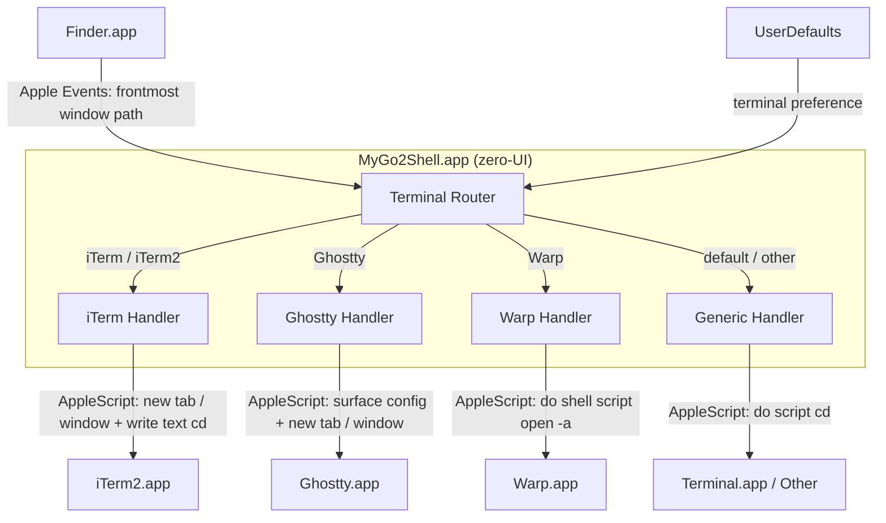

<p align="center">
  
</p>

<h1 align="center">MyGo2Shell</h1>

<p align="center">
  <strong>一键从 Finder 打开终端。</strong>
</p>

<p align="center">
  <a href="https://github.com/yuman07/MyGo2Shell/releases"></a>
  <a href="https://github.com/yuman07/MyGo2Shell/releases"></a>
  <a href="https://github.com/yuman07/MyGo2Shell/stargazers"></a>
  <br>
  
  
  
  
</p>

<p align="center">
  <a href="README.md">English</a> | <a href="README_ZH.md">中文</a>
</p>

---

## MyGo2Shell 是什么？

MyGo2Shell 是一款轻量级 macOS 工具，能够在你当前浏览的 Finder 目录下直接打开终端。支持 **Terminal.app**、**iTerm2**、**Ghostty**、**Warp** 等多种终端。只需将它拖到 Finder 工具栏，点击即用，无需任何配置。

```
Finder (/Users/you/Projects/MyApp)
+----------------------------------------------+
|  <- ->    MyApp      [MyGo2Shell] <- Click!  |
|----------------------------------------------|
|  src/                                        |
|  docs/                                       |
|  README.md                                   |
+----------------------------------------------+
                       |
                       v
Terminal
+----------------------------------------------+
|  $ cd /Users/you/Projects/MyApp              |
|  $ _                                         |
+----------------------------------------------+
```

## 功能特性

- **一键启动** — 点击工具栏图标，即刻在当前 Finder 目录下打开终端
- **多终端支持** — 通过一条 `defaults write` 命令即可切换到 iTerm2、Ghostty、Warp 等终端
- **零配置** — 开箱即用，默认打开 Terminal.app，无需任何设置
- **极致轻量** — 单文件 Swift 应用（约 170 行代码），启动即退出
- **原生体验** — 使用 AppleScript 与 Finder 和 Terminal 无缝通信
- **工具栏集成** — 常驻 Finder 工具栏，随时可用

## 安装

### macOS（15.0+，Apple Silicon）

#### 方式一：一键安装（推荐）

打开终端，粘贴以下命令：

```bash
curl -fsSL https://raw.githubusercontent.com/yuman07/MyGo2Shell/main/install.sh | bash
```

自动下载最新版本，安装到 `/Applications/` 并移除 macOS 隔离标记，即装即用。

#### 方式二：从 GitHub 下载

1. 前往 [Releases](https://github.com/yuman07/MyGo2Shell/releases) 页面
2. 下载最新的 `.dmg` 文件
3. 双击挂载后将 `MyGo2Shell.app` 拖入 `/Applications/`

> **注意：** MyGo2Shell 未使用 Apple 开发者证书签名，macOS Gatekeeper 可能会在首次启动时拦截。可通过以下任一方式允许运行：
>
> **方法一 — 系统设置：**
> 打开 **系统设置 > 隐私与安全性**，滚动到底部，找到 MyGo2Shell 被阻止的提示，点击 **仍要打开**。
>
> **方法二 — 右键打开：**
> 在 `/Applications/` 中右键点击（或按住 Control 点击）`MyGo2Shell.app`，选择 **打开**，然后在确认对话框中再次点击 **打开**。
>
> **方法三 — 移除隔离标记：**
> ```bash
> xattr -cr /Applications/MyGo2Shell.app
> ```

#### 添加到 Finder 工具栏

> 这是让 MyGo2Shell 真正好用的关键步骤！

| 步骤 | 操作 |
|:----:|------|
| **1** | 打开任意 **Finder** 窗口 |
| **2** | 在另一个 Finder 窗口中打开 `/Applications/` |
| **3** | 按住 **`Cmd`** 键，将 `MyGo2Shell.app` **拖入** Finder 工具栏 |
| **4** | 松开鼠标 — 图标即出现在工具栏中 |

```
Before:  <- ->    Documents
After:   <- ->    Documents   [>_]  <- MyGo2Shell!
```

> **提示：** 如需移除，按住 `Cmd` 键将图标拖出工具栏即可。

## 使用

### 切换终端

默认情况下，MyGo2Shell 打开 **Terminal.app**。如需使用其他终端，执行对应的 `defaults write` 命令：

```bash
# 使用 iTerm2
defaults write com.go2shell.MyGo2Shell terminal -string "iTerm"

# 使用 Ghostty（需要 Ghostty 1.3+）
defaults write com.go2shell.MyGo2Shell terminal -string "Ghostty"

# 使用 Warp
defaults write com.go2shell.MyGo2Shell terminal -string "Warp"

# 恢复默认的 Terminal.app
defaults delete com.go2shell.MyGo2Shell terminal
```

终端名称应与 `/Applications/` 中的应用名一致。iTerm2、Ghostty 和 Warp 有内置的原生适配，其他终端使用标准的 AppleScript `do script` 接口。

### 自动化权限

首次启动时，macOS 会请求控制 Finder 和终端的权限，点击 **好** 即可授权——MyGo2Shell 需要 Apple Events 权限来读取 Finder 的当前目录并打开终端窗口。

如果应用打开了终端但没有跳转到正确的目录，请检查 **系统设置 > 隐私与安全性 > 自动化** 中是否已授予相关权限。可能需要先移除再重新添加。

## 开发

> **仅限 macOS。** 构建步骤仅适用于 macOS 环境。

### 前置要求

| 项目 | 最低版本 | 说明 |
|------|---------|------|
| **macOS** | 15.6 (Sequoia) | Xcode 26.3 的系统要求 |
| **Xcode** | 26.3 | 包含 Swift 6、swiftc、actool 和 Git。从 [Mac App Store](https://apps.apple.com/app/xcode/id497799835) 下载 |

### 本地开发构建（Xcode）

本地构建仅用于日常开发调试。**正式 Release 只能通过 [GitHub Actions Release 工作流](.github/workflows/release.yml) 发布**，不要分发本地构建的二进制产物。

```bash
# 克隆仓库到本地
git clone https://github.com/yuman07/MyGo2Shell.git

# 进入项目目录
cd MyGo2Shell

# 打开 Xcode 项目
open MyGo2Shell.xcodeproj
```

然后在 Xcode 中：

1. 选择菜单栏 **Product > Build**（或按 `Cmd + B`）编译
2. 选择 **Product > Show Build Folder in Finder** 找到 `MyGo2Shell.app`
3. 将 `MyGo2Shell.app` 移动到 `/Applications/` 进行本地验证

### 发布 Release

维护者通过 **Actions > Release > Run workflow** 手动触发工作流并填入 semver 版本号；GitHub Actions 在 `macos-26` runner 上构建 app 包，用 `hdiutil` 打成 `.dmg`，并作为 GitHub Release 资源发布。

## 技术概述

MyGo2Shell 是一个无界面的 Cocoa 应用（`LSUIElement = true`），充当 Finder 与终端模拟器之间的桥梁。它没有可见窗口、没有菜单栏图标、也不会驻留进程——启动、完成任务、退出。

核心设计遵循 **fire-and-forget** 模式：应用启动 `NSApplication` run loop 仅用于托管 AppleScript 执行，随后在下一次迭代中终止。这是必要的，因为 `NSAppleScript` 需要活跃的 run loop 来分派 Apple Events，否则对 Finder 和终端的查询会静默失败。

启动后，应用执行三阶段工作流：

1. **路径获取** — 通过 `NSAppleScript` 向 Finder 发送 Apple Events 查询，获取最前面窗口的目标目录的 POSIX 路径。如果没有打开任何 Finder 窗口（或目标无法解析为 alias），脚本回退到 `~/Desktop`。这种两级策略能够处理 Finder 窗口显示搜索结果、AirDrop 或缺少 POSIX 路径的网络卷宗等边界情况。

2. **终端路由** — 应用从 `UserDefaults` 读取 `terminal` 键值（通过 `defaults write com.go2shell.MyGo2Shell terminal "name"` 设置）。原始值经过清洗，剥离字母数字、空格和连字符以外的所有字符——这是为了防止 AppleScript 注入，因为终端名称会被插值到脚本字符串中。清洗结果若为空则回退到 `Terminal`。清洗后的名称通过大小写无关匹配分派到内置处理器：iTerm / iTerm2 使用感知标签页的 AppleScript（前窗口已存在则 `create tab`，否则 `create window`）；Ghostty 使用其 `surface configuration` AppleScript API（`initial working directory` + `initial input`）在前窗口创建新标签页或新窗口；Warp 通过 AppleScript `do shell script "open -a Warp <path>"` 调用原生目录参数；其余终端落到通用 `do script` AppleScript 处理器。每个处理器都区分「应用已在运行」的快速路径与「冷启动后轮询 `count of windows > 0`」的慢速路径，所有 `cd` 都会追加 `&& clear` 以呈现干净的提示符。如果配置的终端在 `/Applications/`、`/System/Applications/`、`/System/Applications/Utilities/` 或 `~/Applications/` 中均未找到，则自动回退到 Terminal.app。

3. **自动退出** — `openShellInFinderDirectory` 全程同步（每个 `NSAppleScript.executeAndReturnError` 都会阻塞等待脚本返回）。它返回后通过 `DispatchQueue.main.async` 把 `NSApp.terminate` 调度到下一次主循环迭代，让 `applicationDidFinishLaunching` 先干净退出，再拆除应用。

### 技术栈

| 类别 | 技术 |
|------|-----|
| 语言 | Swift 6.0 |
| 框架 | Cocoa (AppKit) |
| 进程间通信 | AppleScript（通过 `NSAppleScript`） |
| 配置 | `UserDefaults`（`defaults write`） |
| 构建系统 | Xcode（本地开发）/ GitHub Actions（`swiftc` + `actool` + `hdiutil`，发布） |
| 架构 | arm64 (Apple Silicon) |
| 部署目标 | macOS 15.0 (Sequoia) |

### 架构



- **路径获取流** — Finder.app 接收来自 Terminal Router 的 Apple Events 查询，返回最前面窗口目标的 POSIX 路径。如果查询失败，路由器回退到 `~/Desktop`
- **终端路由逻辑** — 路由器从 UserDefaults 读取用户的终端偏好，清洗输入（剥离不安全字符，若为空则默认 `Terminal`），然后根据大小写无关的名称匹配分派到四个专用处理器之一；未识别但已安装的终端落到通用处理器，未安装的名称则回退到 Terminal.app
- **处理器特化** — 每个处理器针对目标终端优化：iTerm Handler 使用感知标签页的 AppleScript（前窗口已存在则创建新标签页，否则创建新窗口），Ghostty Handler 使用 `surface configuration` AppleScript API + `initial working directory` + `initial input` 创建标签页或窗口，Warp Handler 通过 AppleScript `do shell script "open -a Warp <path>"` 调用（Warp 直接接受目录参数），Generic Handler 使用通用的 `do script` AppleScript 接口兼容所有支持脚本的终端。每个处理器都区分「应用已运行」的快速路径与「冷启动后等待首个窗口出现」的慢速路径。

### 项目结构

```
MyGo2Shell/
|-- MyGo2Shell/
|   |-- main.swift              # 应用代理、终端路由、AppleScript 执行
|   |-- Info.plist              # Bundle 元数据（LSUIElement、版本、权限）
|   |-- MyGo2Shell.entitlements # Apple Events 自动化权限
|   `-- Assets.xcassets/        # 应用图标（16x16 到 512x512，1x 和 2x）
|-- assets/
|   `-- app-icon.png            # 图标源文件（128x128）
|-- MyGo2Shell.xcodeproj/       # Xcode 项目配置
|-- .github/workflows/          # GitHub Actions 发布工作流（swiftc + actool + hdiutil）
|-- install.sh                  # 一键安装脚本（下载最新 Release）
|-- README.md                   # 英文文档
|-- README_ZH.md                # 中文文档
`-- LICENSE                     # MIT 许可证
```

## 致谢

灵感来源于已停止维护的 [Go2Shell](https://zipzapmac.com/Go2Shell)。MyGo2Shell 是基于纯 Swift + AppleScript 的全新开源重写版本。

## 许可证

本项目基于 [MIT License](LICENSE) 开源。
